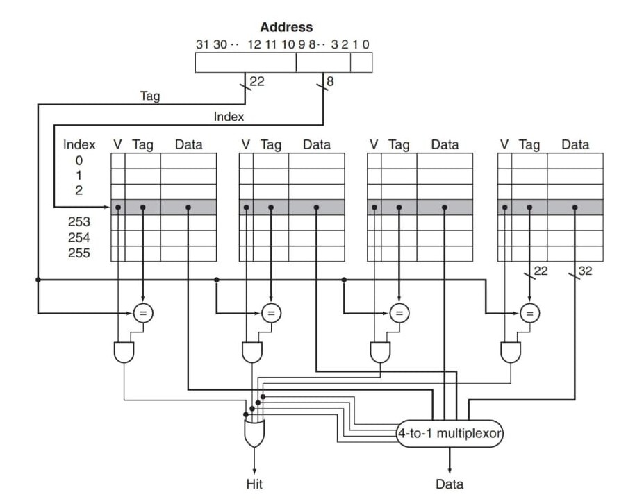
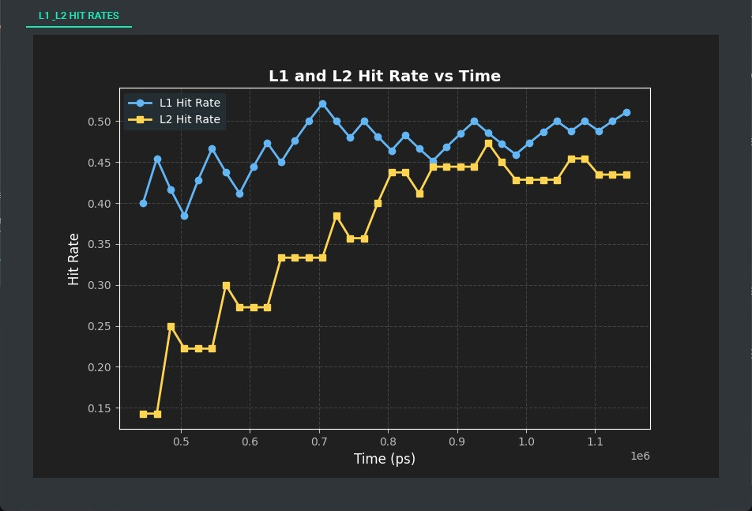

# Cache Memory Simulator & Analysis Platform


This project provides a **GUI-based frontend** for simulating, analyzing, and visualizing various cache memory architectures using Vivado and Python.  

It is designed for easy configuration, reproducibility, and modularity—even for users new to Vivado.

<p align="center">
  <table>
    <tr>
      <td align="center">
        
        <br/>
        <b>Direct Mapped</b>
      </td>
      <td align="center">
        
        <br/>
        <b>Set Associative</b>
      </td>
    </tr>
  </table>
</p>
 
---


## Table of Contents


- [1. Project Directory Structure](#1-project-directory-structure)

- [2. Images](#2-images)

- [3. Prerequisites](#3-prerequisites)

- [4. Vivado Installation (Step-by-Step)](#4-vivado-installation-step-by-step)

- [5. Python Environment Setup](#5-python-environment-setup)

- [6. Vivado Project Setup](#6-vivado-project-setup)

- [7. Configuration](#7-configuration)

- [8. Running the GUI Frontend](#8-running-the-gui-frontend)

- [9. Troubleshooting](#9-troubleshooting)

- [10. Reference Links](#10-reference-links)


---

## 1. Project Directory Structure


Your project should look like this (after setup):


````

project_root/

│
├── backend/
│ ├── precomp_metrics/
│ │ ├── power1.txt
│ │ ├── power2.txt
│ ├── project_1/
│ │ ├── project_1.xpr
│ │ └── ...
│ ├── project_2/
│ │ ├── project_2.xpr
│ │ │ ├── power1.txt
│ │ │ └── power2.txt
│ │ └── ...
│ ├── project_3/
│ │ ├── project_3.xpr
│ │ └── ...
│ └── project_4/
│ ├── project_4.xpr
│ └── ...
│
├── hdl_src/
│ ├── project_1/
│ │ └── <Verilog/VHDL source files>
│ ├── project_2/
│ │ └── <Verilog/VHDL source files>
│ ├── project_3/
│ │ └── <Verilog/VHDL source files>
  └── project_4/
│   └── <Verilog/VHDL source files>
│
└── frontend/
  ├── main.py
  ├── graph_display.py
  ├── config.py
  └── venv/
    └── ...

````

---

## 2. Images

<p align="center">
  <table>
    <tr>
      <td align="center">
        
        <br/>
      </td>
      <td align="center">
        
        <br/>
      </td>
    </tr>
  </table>
</p>

<p align="center">
  <table>
    <tr>
      <td align="center">
        
        <br/>
      </td>
      <td align="center">
        
        <br/>
      </td>
    </tr>
  </table>
</p>

---

## 3. Prerequisites


- **Windows PC** with admin rights

- **At least 32 GB free disk space**

- **Python 3.8+** (64-bit recommended)

- **Internet connection** (for Vivado and Python package downloads)


---


## 4. Vivado Installation (Step-by-Step)


### 4.1 Download Vivado


- Go to the [Xilinx/AMD Vivado Download Page](https://www.xilinx.com/support/download.html).

- Choose the version recommended for this project (e.g., 2018.3 or later).

- Download the **Web Installer** or the **Full Product Installer**.


### 4.2 Create a Xilinx Account


- If prompted, create a free Xilinx/AMD account.  

 (You will need to provide an email address and set a password.)


### 4.3 Run the Installer


- Run the downloaded installer (`.exe` file).

- Grant admin permissions when prompted.

- Follow the on-screen instructions:

   - Choose **Download and Install**.

   - Select **Vivado Design Suite** (not Vitis unless you need it).

   - Choose the **Artix-7** device family (or your board's family) to minimize download size.

   - Accept the license agreements.

   - Choose an installation directory (avoid spaces in the path, e.g., `C:XilinxVivado2018.3`).

   - Wait for the download and installation to complete. This may take 30–60 minutes depending on your connection and system speed.


### 4.4 Activate Your License


- After installation, the Vivado License Manager will open.

- Select the free WebPACK license or load a license file if provided.

- Finish setup.


### 4.5 (Optional) Install Board Support Files


- If you use Digilent or other boards, you may need to install board files.  

 See [Digilent's guide](https://digilent.com/reference/programmable-logic/guides/installing-vivado-and-sdk).


---


## 5. Python Environment Setup


1. **Open a terminal** and navigate to the `frontend/` directory.


2. **Create a virtual environment** (recommended):


   ```

   python -m venv venv

   venvScriptsactivate      # On Windows

   # source venv/bin/activate # On Linux/Mac

   ```


3. **Install required Python packages**:


   ```

   pip install -r PyQt6 qt-material matplotlib numpy

   ```


   > Required packages include: `PyQt6`, `qt-material`, `matplotlib`, `numpy`


---


## 6. Vivado Project Setup


1. **Open Vivado**.


2. **For each project** (`project_1`, `project_2`, `project_3`, `project_4`):


   - Create a new Vivado project in the corresponding `backend/project_X/` folder.

   - **Project name** must match the folder (e.g., `project_1` for `backend/project_1/`) and **should not contain spaces**.

   - When creating the project, select **RTL Project** and check "Do not specify sources at this time."

   - After creation, **add HDL source files** from `hdl_src/project_X/`:

       - **If the filename contains `sim` or `tb` (e.g., `cache_tb.v`, `lru_sim.vhd`):**

           - Add as a **simulation source**.

       - **Otherwise:**

           - Add as a **design source**.

   - (Optional) Add any custom TCL scripts as needed.


3. **Run synthesis and simulation at least once in Vivado** to verify the project is set up correctly.


---


## 7. Configuration


1. **Edit `frontend/config.py`** to match your Vivado installation and project paths:

   - Set `VIVADO_SETTINGS_BAT` to your Vivado installation's `settings64.bat` (e.g., `C:/XilinxVivado2018.3/settings64.bat`).

   - Set `VIVADO_BIN` to `vivado` or the full path to the Vivado executable.

   - Set `BACKEND_ROOT` to the absolute path of your `backend` directory.

   - Ensure all paths in the `PROJECTS` dictionary are correct.


2. **No code changes are needed**—all paths are configurable via `config.py`.


---


## 8. Running the GUI Frontend


1. **Activate your Python virtual environment** if not already active:


   ```

   venv/Scripts/Activate.ps1

   ```


2. **Launch the GUI**:


   ```

   python main.py

   ```


3. **Using the GUI**:


   - Select the desired cache architecture.

   - Click "Run Vivado Simulation."

   - The frontend will automatically generate the necessary TCL script, launch Vivado in batch mode, and display simulation results.


---


## 9. Troubleshooting


- **Vivado not found or simulation does not run:**  

 Double-check `VIVADO_SETTINGS_BAT` and `VIVADO_BIN` in `config.py`.


- **File/path errors:**  

 Ensure all project folders and `.xpr` files exist as described above.  

 Paths in TCL scripts must use double backslashes (`\\`) on Windows—this is handled automatically by the frontend.


- **Python errors:**  

 Make sure all dependencies are installed in your virtual environment.


- **Permissions:**  

 Run Vivado and Python as administrator if you encounter access errors.


---


## 10. Reference Links


- [Vivado Download Page](https://www.xilinx.com/support/download.html)

- [Official Vivado Installation Guide (PDF)](https://www.xilinx.com/support/documents/sw_manuals/xilinx2022_1/ug973-vivado-release-notes-install-license.pdf)

- [Digilent Vivado Getting Started Guide](https://digilent.com/reference/vivado/getting_started/start)

- [Video: How to Install Vivado on Windows (YouTube)](https://www.youtube.com/watch?v=MqObcLxrwDY)

- [Video: Install Vivado 2023 for Free (YouTube)](https://www.youtube.com/watch?v=Lc2EEbZmlz0)


---


### **License**

[GNU General Public License v3.0](LICENSE)


